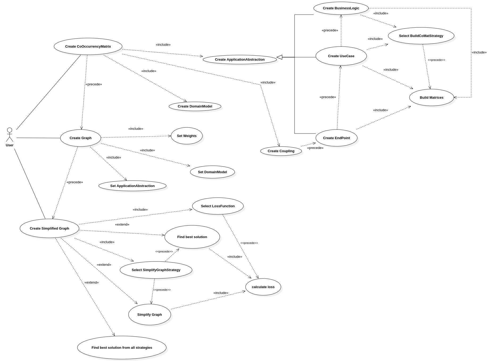
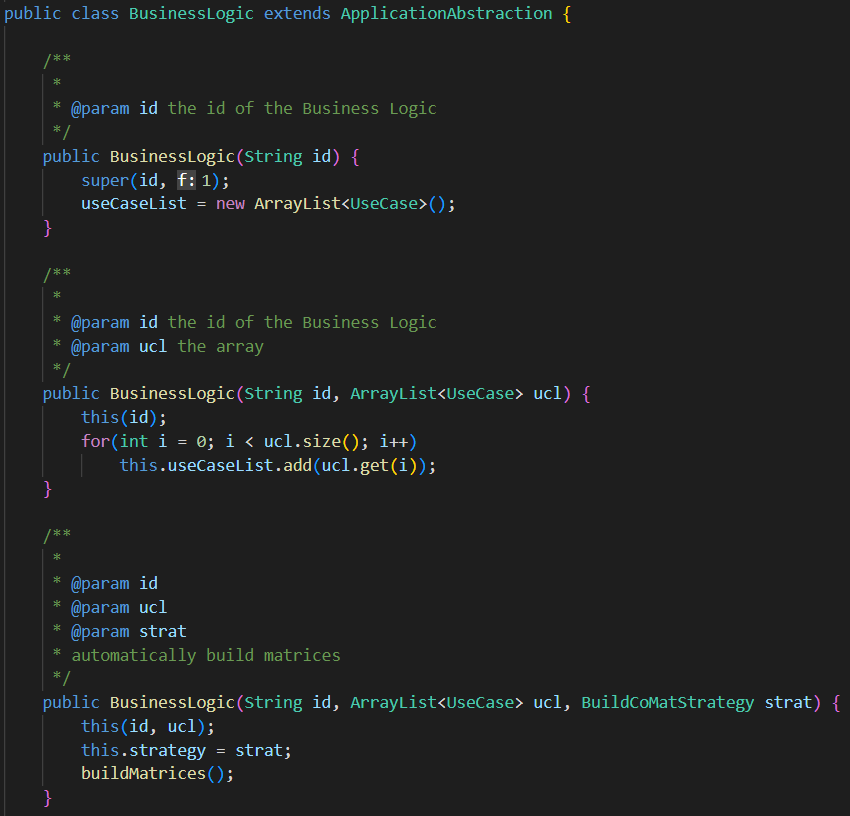
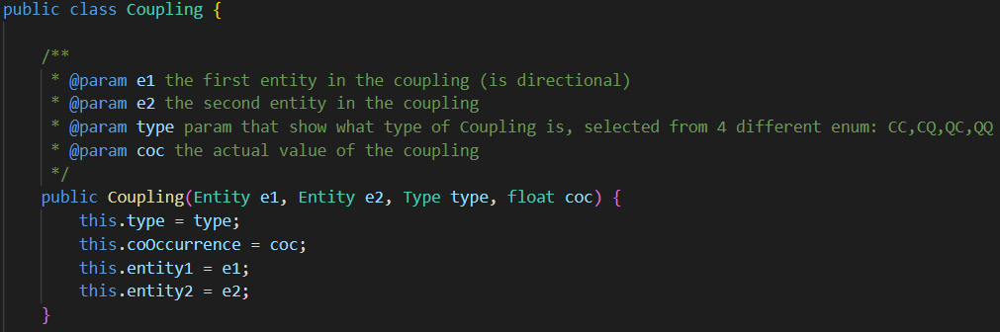
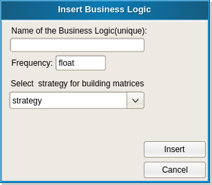
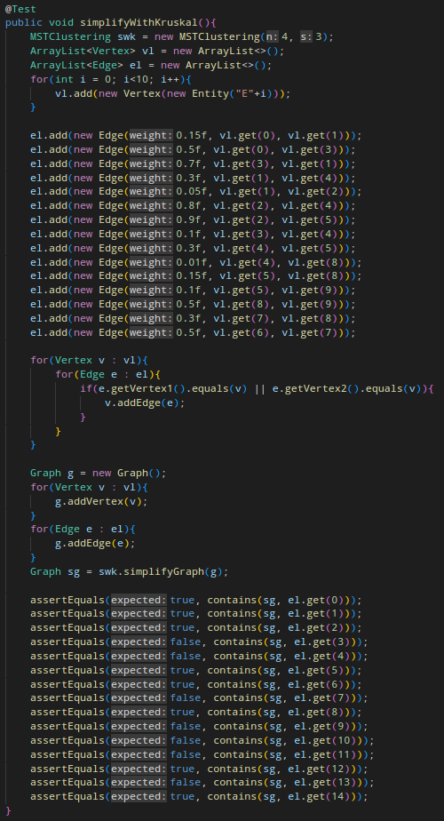
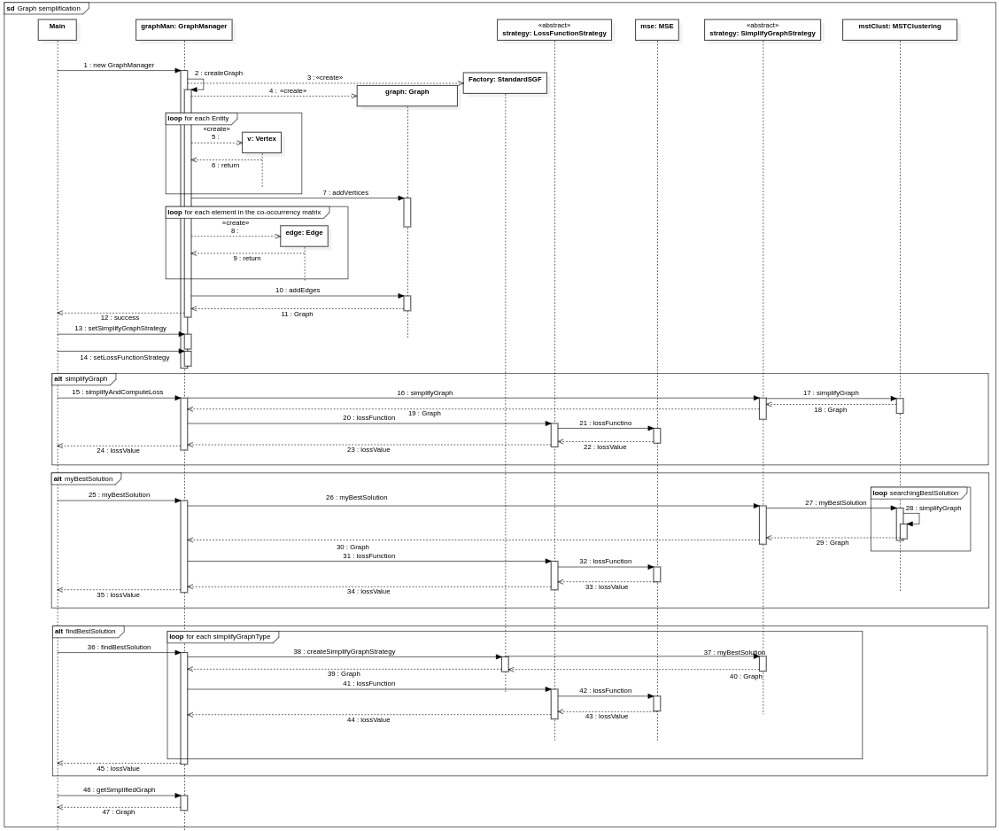

### **UNIVERSITA’ DEGLI STUDI DI FIRENZE**
### Corso di Laurea in Ingegneria Informatica
### Elaborato del corso Ingegneria del Software

# **Obiettivo e Descrizione**

Si vuole effettuare il Reactoring di una applicazione monolitica Restful in forma di microservizi.\
Un'applicazione monolitica Restful è dotata di un unico Layer e di un unico Domain Model su cui si espongono tutti i servizi.\
Un'architettura basata su microservizi è realizzata da componenti indipendenti che eseguono ciascun processo applicativo come un servizio.

Ci interessa valutare il carico di IPC (InterProcess Communication) che risulta da diverse soluzioni di Refactoring.
Per farlo, si modella il Domain Model come un grafo in cui i vertici rappresentano le Entità, e gli archi rappresentano l'accoppiamento tra due diverse Entità.\
Successivamente si semplifica il grafo cancellando archi meno pesanti fino ad ottenere delle componenti non connesse e semplici abbastanza.\
Queste componenti non connesse rappresenteranno i microservizi.

Per costruire il grafo passiamo attraverso l'utilizzo delle matrici di Co-Occorrenza, che mappano l'accoppiamento tra le entità su diversi aspetti.

Per questo elaborato, le matrici di Co-Occorrenza sono un dato. In particolare il Software riceve in ingresso i singoli accoppiamenti (Couplings) tra le Entità e con questi costruisce le 4 Matrici di Co-Occorrenza.

La semplificazione del grafo può essere effettuata utilizzando diversi algoritmi. Per questo motivo si è utilizzato il Design Pattern Strategy al fine intercambiare le varie tecniche di semplificazione.

Al fine di valutare il costo delle diverse semplificazioni si utilizza una Funzione di Loss, la quale tiene conto del peso sui tagli e la complessità delle componenti connesse.

# **Possibili aggiunte**

Elenchiamo di seguito possibili implementazioni aggiuntive per questo Software:

- **Sviluppo di un front-end** con interfaccia grafica al fine di facilitare l'inserimento dei dati all'utente.

- Aggiungere la possibilità di **salvare i risultati sul disco**, in modo tale che l'utente possa caricare risultati precedentemente ottenuti e proseguire il suo lavoro dal punto in cui era rimasto.

# **Requisiti**

## Use Case

## Use Case Template

# **Progettazione ed Implementazione**

## Scelte implementative e considerazioni

## Class Diagram
Di seguito proponiamo il Class Diagram sviluppato:

## Classi ed Interfacce

### **CoOccurrenceMatrix**
Contiene i dati relativi alla cooccorrenza tra le entità di una data ApplicationAbstraction. I dati sono memorizzati in una matrice quadrata, dove le righe e le colonne sono associate alle entità contenute nella ApplicationAbstraction tramite una HashMap.

Permette anche di verificare se un’entità è presente o meno nelle righe e colonne della matrice tramite il metodo *isInMatrix(Entity e)*.

### **ApplicationAbstraction, EndPoint, UseCase e BusinessLogic**
ApplicationAbstraction è una classe astratta che definisce attributi e metodi usati dalle classi EndPoint, UseCase e BusinessLogic. Contiene 4 matrici di cooccorrenza, associate al rispettivo tipo tramite una HashMap. Espone il metodo astratto *buildMatrices()* per fare in modo che ognuna delle classi derivate possa costruire le sue matrici di cooccorrenza in modo diverso. EndPoint costruisce le matrici di cooccorrenza tramite una lista di Coupling data in input, mentre UseCase e BusinessLogic le costruiscono utilizzando una BuildCoMatStrategy.

### **Coupling**
È una classe che contiene un singolo valore di cooccorrenza tra due entità. I dati di input verranno memorizzati in istanze di questa classe, che andranno a loro volta a formare le matrici di cooccorrenza degli EndPoint. Ogni istanza di Coupling corrisponderà a una singola casella di una matrice di cooccorrenza.

### **DomainModel** 
Questa classe rappresenta il domain model dell’applicazione monolitica restful di partenza. In particolare, contiene una lista di tutte le entità dell’applicazione di partenza.

### **BuildCoMatStrategy e BuildMatricesFactory**
BuildCoMatStrategy è l’interfaccia dello strategy pattern utilizzato per creare le matrici di cooccorrenza di UseCase e BusinessLogic. Le strategie concrete devono implementare il metodo *buildCoMat()*, che crea le matrici di cooccorrenza degli UseCase e della BusinessLogic, unendo le matrici di cooccorrenza delle ApplicationAbstraction di livello inferiore che essi contengono (degli EndPoint nel caso di uno UseCase, degli UseCase nel caso della BusinessLogic).
 
BuildMatricesFactory ha il compito di istanziare dinamicamente la strategia scelta per la creazione delle matrici di cooccorrenza.  

### GraphManager
Questa classe ha lo scopo di costruire e contenere il grafo generato dalle matrici di cooccorrenza di una ApplicationAbstraction, e di invocare una SimplifyGraphStrategy e una LossFunctionStrategy, al fine di scomporre il grafo tagliando determinati archi, minimizzando la funzione di loss. 

La funzione *simplifyAndComputeLoss()* permette di semplificare il grafo con la strategia contenuta in GraphManager con dei parametri di default.

La funzione *myBestSolution()* calcola la semplificazione migliore con la strategia contenuta in GraphManager, iterando sui parametri specifici della strategia.

La funzione *findBestSolution()* permette di iterare su tutte le strategie di semplificazione implementate, calcolando la soluzione migliore per ciascuna strategia, confrontandole e scegliendo la migliore.

Tutte e tre queste funzioni ritornano il valore di loss della semplificazione, e salvano il grafo semplificato dentro GraphManager.  

### SimplifyGraphStrategy, SimplifyGraphFactory, LossFunctionStrategy e LossFunctionFactory
SimplifyGraphStrategy e LossFunctionStrategy sono le interfacce rispettivamente dello strategy pattern utilizzato per semplificare il grafo e di quello utilizzato per stimare il costo in termini di IPC che una particolare semplificazione del grafo comporta. Le strategie di semplificazione concrete devono implementare un metodo *simplifyGraph()* per semplificare il grafo usando dei parametri di default, e un metodo *myBestSolution()* per iterare la semplificazione del grafo di partenza con diversi parametri, per trovare la semplificazione migliore.
 
SimplifyGraphFactory e LossFunctionFactory hanno rispettivamente il compito di istanziare dinamicamente la strategia di semplificazione e la funzione di loss scelta.

### Graph, Edge e Vertex
Queste tre classi implementano la struttura del grafo.
 
La classe Graph contiene una lista di tutti gli archi e una di tutti i vertici, insieme ai metodi per aggiungere e rimuovere elementi dalle liste.

La classe Edge rappresenta gli archi, contiene il peso dell’arco, i due vertici connessi, e un metodo getConnVertex(Vertex v) che ricevendo uno dei due vertici dell’arco ritorna l’altro. Gli archi sono adirezionali.

La classe Vertex rappresenta i vertici, contiene una lista di tutti gli archi a cui è connesso il vertice.

## Mockups
Di seguito vengono proposti dei mockups di una possibile implemetazione di un front-end. Il software utilizzato è Pencil. 
 

Qui possiamo vedere l'interfaccia principale dell'applicativo, permette di inserire i vari elementi di una applicazione, salvare l'applicazione caricata così da facilitarne il caricamento per usi futuri e visualizzare tutti gli oggetti dell'applicazione. 
 

 
Nella fase di inserimento si prevede un ordine prestabilito: Entity, Couplings, EndPoints, UseCases e infine BusinessLogic. I bottoni saranno disattivati finché non sarà rispettato l'ordine di precedenza. Ognuno dei bottoni dell'interfaccia principale apre una nuova finestra che permette di inserire uno o più elementi di quel tipo(apparte per Business Logic di cui se ne prevede una sola). Di seguito sono riportate le varie interfaccie per gli input.

Una volta eseguito tutto l'input (almeno fino ad EndPoint), verrà attivato il tasto **Compute Microservices** che permetterà di cominciare la procedura atta a semplificare l'applicazione monolitica in ingresso in una possibile applicazione a microservizi. Una volta premuto il tasto, comparirà la seguente finestra:

Questa è una finestra che permette di scegliere a quale livello (EndPoint, UseCase o BusinessLogic) eseguire l'algoritmo di semplificazione. In caso di **EndPoint** o **UseCase** verrà anche attivato il menù a tendina che permetterà di scegliere su quali, tra gli **EndPoint** o gli **UseCase** , eseguire l'algoritmo di semplificazione. Inoltre Vengono poi aggiunti dei pesi a descrizione dell'utente sui vari tipi di co-occorrenza (lasciarli vuoti significa = 1). 
Una volta inserite tutte le informazioni, cliccando su next, si procede nella prossima finestra:

Qui si apre la scelta di quale loss function usare ( se sono state implementate), oppure quale strategia di semplificazione usare. Infine, a discapito dell'utente, è possibile scegliere mediante i 3 tasti a sinistra, il tipo di semplificazione: I primi due tasti dipendono dalla scelta della strategia di semplificazione e dalla loss function perciò saranno attivati solo quando entrambe saranno state scelte. L'ultimo dipende solo dalla loss function perciò basta la scelta di quest'ultima per poter attivare il bottone **Best semplification**. 
Una volta premuto una delle 3 scelte, si aprirà la seguente finestra:

Qui si può analizzare la soluzione data dall'algoritmo iin forma di grafo: il prima (a sx) e il dopo (a dx) della trasformazione in microservizi, riportando sulla destra il punteggio della loss function. 

## Design Patterns

All'interno del progetto abbiamo fatto uso dei seguenti Design Pattern:

- Strategy

- Factory

### STRATEGY

Lo **Strategy** è un Design Pattern comportamentale che permette di cambiare il comportamento di una classe a runtime, cambiando l'algortmo utilizzato per svolgere ua determinata mansione.
Abbiamo scelto di utilizzare il Design Pattern Strategy al fine di offrire all'utente la possibilità di effettuare numerose scelte, in particolare sugli algoritmi di semplificazione del grafo, di valutazione della loss e di costruzione delle matrici di cooccorrenza.
In questo modo viene anche offerta all'utente la possibilità di effettuare delle valutazioni sui risultati provenienti dall'utilizzo di particolari combinazioni di algoritmi.

### FACTORY

Il **Factory** è un Design Pattern creazionale che permette di istanziare oggetti più facilmente, senza dover specificare i dettagli.
Abbiamo deciso di utilizzare il Design Pattern Factory al fine di rendere più elegante, ordinata ed agevole la creazione automatica delle differenti strategie di semplificazione del grafo, di costruzione delle matrici di co-occorrenza e di costruzione delle funzioni di loss.
In particolare viene utilizzato:
- all'interno del metodo "findBestSolution()" della classe GraphManager, in quanto questo metodo necessita di utilizzare tutte le diverse streategie di semplificazione del grafo, al fine di trovare la strategia che minimizza il valore della loss. 
- all'interno della classe InputManager, per ottimizzare la creazione delle strategie di costruzione delle matrici di co-occorrenza e delle strategie di calcolo della loss, a partire dall'input dei file JSON.

## Disposizione delle classi nei package

# **Unit Test**
Siccome ogni classe è fortemente collegata alle altre, è stata presa la decisione di testare la maggior parte del codice per evitare il maggior numero di bugs. Nel progetto è stato usato il framework JUnit 4.13.2.
### **AppModelTest**
In questa classe di test sono state testate tutte le classi appartenenti al package **ApplicationModel**. In particolare sono stati testati i metodi di creazione delle matrici, e selezione della strategia a livello di EndPoint e di UseCase. A livello di BusinessLogic non è stato eseguito alcun test poichè risulterebbero ripetitivi.

### **WeightedGraphTest**
Classe di test per il grafo pesato. Essendo una struttura abbsastanza complessa, è stato valutato utile eseguire dei test su queste classi.

### **ManagerTest**
Classe di test per tutta la parte di creazione del grafo e semplificazione del grafo. Test molto importanti in quanto verificano la correttezza matematica delle varie strategie utilizzate.

### **Sequence Diagram**
Di seguito riportiamo lo scenario di interazione applicazione/utente della parte di semplificazione del grafo.
